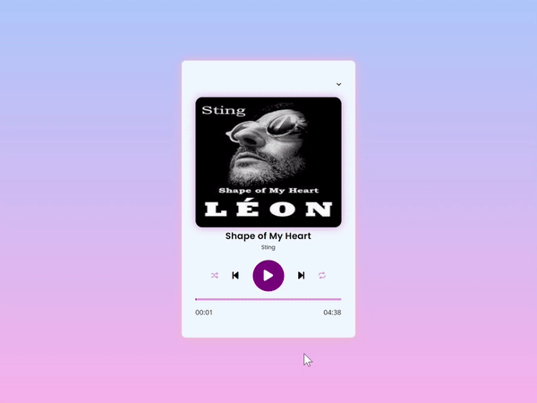

<h1> Media Player Projesi</h1>

HTML, CSS ve JavaScript kullanarak hazırlanılmış bir medya oynatıcıdır. Oynat, duraklat, sonraki & önceki şarkı, karıştır ve tekrar et özellikleri mevcuttur.

Ayrıca açılır listeden şarkı seçme özelliği eklenmiştir. Kullanıcı, çalma listesindeki şarkılardan birini seçerek hızlıca oynatmaya başlayabilir.
Bu medya oynatıcısı, kullanıcı dostu bir arayüz sunarak temel müzik dinleme deneyimini iyileştirir. Kullanıcılara basit kontrol, gezinme seçenekleri ve şarkı seçme özelliği ile müzik dinleme keyfi sağlar.

<h2> Özellikler </h2>

<ul>
<li>Oynat/Duraklat özelliği </li>
<li>Sonraki ve önceki parça gezintisi</li>
<li>Karıştırma ve tekrar etme seçenekleri</li>
<li>Zaman göstergeli ilerleme çubuğu</li>
<li>Şarkı detayları içeren çalma listesi</li>
<li>Responsive tasarım</li>
</ul>

<h2> Kullanilan Teknolojiler </h2>
<ul>
<li>HTML5</li>
<li>CSS</li>
<li>JavaScript</li>
<li>Bootstrap</li>

</ul>

<h2>Ekran Görüntüsü</h2>

